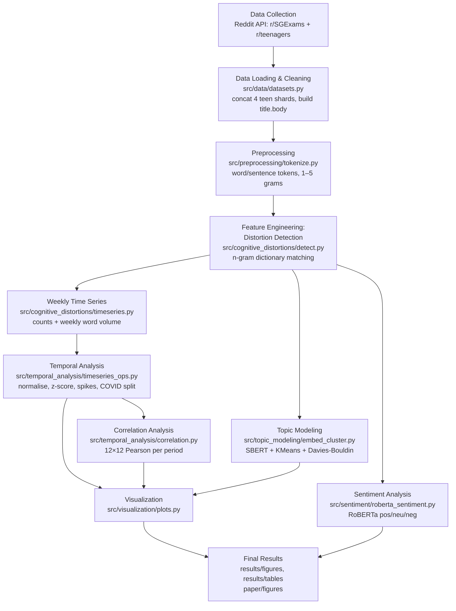

<!--
WHY THIS FILE EXISTS (Step 2 of the brief)
Documents the complete research pipeline inferred from the notebooks + manuscript,
mapping each stage to the module that implements it and the CLI stage that runs it.
-->
# Research Pipeline

This project tracks **12 categories of cognitive distortions** in two Reddit
communities (r/SGExams, r/teenagers) before / during / after COVID-19, adapting
the Google-Books methodology of Bollen et al. (2021) to social-media text.

## Workflow diagram

## Stage-by-stage

| # | Stage | Module | `run_pipeline.py --stage` | Output |
|---|---|---|---|---|
| 1 | **Data collection** | (external; Reddit API) | — | raw CSVs in `data/raw/` |
| 2 | **Loading & cleaning** | `src/data/datasets.py` | (implicit; falls back to `make_sample`) | in-memory frames |
| 3 | **Preprocessing** | `src/preprocessing/tokenize.py` | (used by detect/timeseries) | tokens, n-grams |
| 4 | **Feature engineering / detection** | `src/cognitive_distortions/detect.py` | `detect` | per-doc count matrices, per-doc correlation |
| 5 | **Weekly time series** | `src/cognitive_distortions/timeseries.py` | `timeseries` | `*_weekly_raw/normalized/zscore.csv` |
| 6 | **Temporal analysis** | `src/temporal_analysis/timeseries_ops.py` | `timeseries` | normalised/z-scored series, spikes, COVID split |
| 7 | **Correlation** | `src/temporal_analysis/correlation.py` | `correlation` | `*_correlation_{overall,before,during,after}.csv` |
| 8 | **Topic modeling** | `src/topic_modeling/embed_cluster.py` | `topic_model` | cluster example tables, Davies-Bouldin & frequency figs |
| 9 | **Sentiment** | `src/sentiment/roberta_sentiment.py` | `sentiment` | per-sentence sentiment CSV |
| 10 | **Visualization** | `src/visualization/plots.py` | `visualize` | all `results/figures/*.png` |
| 11 | **Statistical analysis** | correlation + Davies-Bouldin (above) | — | the matrices and cluster-selection curves |
| 12 | **Final results** | `scripts/reproduce_paper_results.py` | — | `paper_results_manifest.csv` mapping outputs → paper figures |

## Normalisation & definitions (from the manuscript Methods)

- **Weekly count:** `X_j(c) = Σ_{i∈c} count(ngram_i, week j)`
- **Normalised:** `X̄_j(c) = X_j(c) / N_j`, where `N_j` = total unigrams in week *j* (`total_unigrams` column).
- **Z-score:** `Z_j(c) = (X̄_j(c) − μ) / σ` over the whole study period.
- **Major spike:** week where the value exceeds the trailing 4-week mean by > 1 SD.
- **COVID windows (UTC seconds):** start `1579478400`, end `1594598400`, study end `1697372672` (configurable in `configs/temporal.yaml`).
- **Optimal #topics:** the *k* (10…k_max) minimising the **Davies-Bouldin** index.
